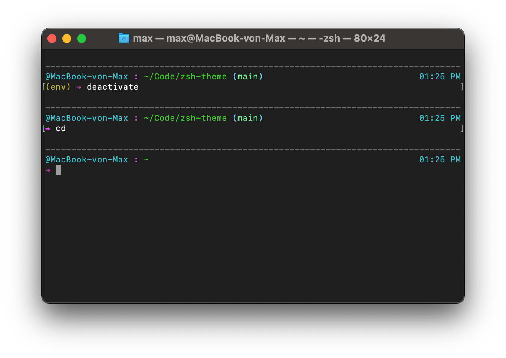

# my-zsh-theme

This repo contains my own oh-my-zsh theme.

If you like it, feel free to use it.

If you find configuration you like, check out the code. Maybe you can adapt your config.

## Features

- Git integration
- Python venv integration
- Display of current host and current path (3 levels
- current time on right side
- command sepearator

